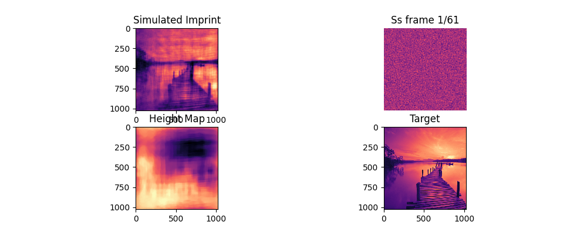
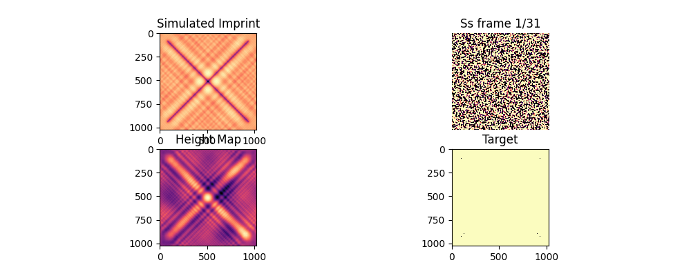
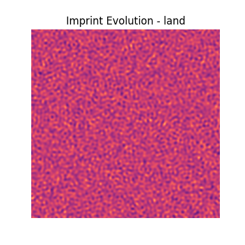
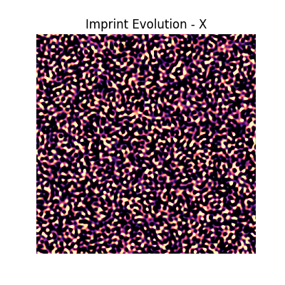

# Differentiable Inverse Lithography Solver

This project implements a gradient-based optimization pipeline using **JAX** to solve inverse lithography problems. It uses a differentiable forward-model of optical diffraction to optimize a phase-mask for sub-wavelength patterning.

## How it works
1. A random phase map is initialized.
2. Diffraction is simulated to distance z via solving:
$$\frac{\partial U_z}{\partial z} = \frac{i}{2k} \nabla^2_\perp U$$
Where:
* $U_z$ is the complex amplitude of the electric field.
* $k$ is the wavenumber ($2\pi/\lambda$).
* $\nabla^2_\perp$ is the transverse Laplacian $(\frac{\partial^2}{\partial x^2} + \frac{\partial^2}{\partial y^2})$.

3. Phase map is adjusted to minimize the resulting diffraction pattern and target pattern. 

